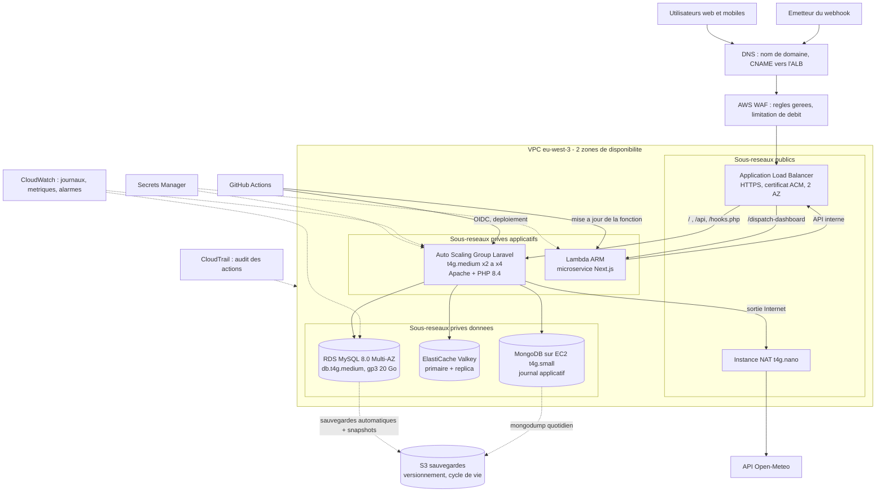

Candidat 06 - LISOWSKI François

# Architecture cible et choix de l'hebergement

> Competence evaluee : `C29` — Selectionner une plateforme d'hebergement adaptee aux exigences techniques, economiques, qualitatives et reglementaires.

Session du 10 septembre 2026. Les mesures proviennent des environnements de qualification et de production. Les prix sont ceux des grilles publiques AWS pour la region `eu-west-3` (Paris), a la demande, en USD hors taxes. Grilles telechargees le 10/09/2026 : EC2, RDS et Lambda publiees le 09/09/2026 ; ALB, S3, VPC, CloudWatch, WAF et Secrets Manager le 31/08/2026 ; ElastiCache le 08/09/2026.

## 1. Analyse des besoins techniques

### 1.1 Composants et dependances

| Composant | Technologie constatee | Besoin d'hebergement |
| --- | --- | --- |
| Application coeur (web, API REST, webhook `hooks.php`) | Laravel 12 / PHP 8.4 (`ext-mongodb`, `redis`, `intl`), Apache | calcul applicatif, sans etat si sessions et cache sont externalises |
| Microservice `dispatch-dashboard` | Next.js 15 / Node.js, rendu serveur a chaque requete, appelle l'API Laravel | calcul a la demande, faible trafic (superviseurs) : candidat naturel au serverless |
| Base relationnelle | MySQL 8.0 : users, customers, sites, tickets, interventions, api_tokens, cache, sessions, jobs | base managee, haute disponibilite, sauvegarde a point de restauration |
| Base NoSQL | MongoDB 8.0, journal `event_logs` | stockage de documents, criticite moindre (l'application tolere son absence) |
| Cache | Redis 7 installe, cache et sessions actuellement en base | cache et sessions partages entre plusieurs instances applicatives |
| Integrations | API publique Open-Meteo (sortant), webhook entrant | sortie Internet controlee, point d'entree public protege |
| Exploitation | GitHub Actions, sondes, sauvegardes, TLS | pipeline, supervision centralisee, stockage de sauvegardes hors machine |

### 1.2 Mesures sur l'existant (10/09/2026)

| Mesure | Valeur |
| --- | --- |
| Machine actuelle (qualification et production) | AWS EC2 `t3.small`, 2 vCPU, 1,9 Go RAM, disque 6,8 Go, `eu-west-3c` |
| Memoire utilisee en production | 1 094 Mo sur 1 907 Mo. Principaux processus : `mysqld` 420 Mo, `mongod` 179 Mo, `next-server` 100 Mo, Apache environ 52 Mo par processus |
| Disque | 83 % occupe (5,6 Go sur 6,8 Go), notamment apres le build Next.js |
| Charge CPU | `load average: 0.01, 0.02, 0.00` |
| Temps de reponse depuis Internet (5 mesures, mediane) | `/api/health` 62 ms, `/` 80 ms, `/dispatch-dashboard` 97 ms |
| API `GET /api/v1/tickets` (mesure locale) | environ 50 ms |
| Volume de donnees | MySQL `opstrack` 432 Ko ; MongoDB `opstrack_logs` 49 documents, 9 Ko |

Constats :
- Le jeu de donnees est un jeu de demonstration : la volumetrie reelle reste a projeter.
- La machine unique concentre tous les services. Elle n'a pas de marge memoire pour la croissance : le build Next.js et MySQL se disputent 1,9 Go.
- Chaque composant est un point unique de defaillance.

### 1.3 Hypotheses de croissance retenues pour le dimensionnement

| Indicateur | Hypothese a 2 ans |
| --- | --- |
| Clients / sites | 50 clients, 500 sites |
| Utilisateurs | 30 superviseurs, 300 techniciens (usage mobile en journee) |
| Tickets | 5 000 par mois, 3 interventions par ticket en moyenne |
| Trafic | 20 requetes/s en pointe (8h-18h), 5 millions de requetes par mois |
| Donnees | MySQL moins de 20 Go a 2 ans ; journal MongoDB environ 5 Go par an ; journaux applicatifs environ 5 Go par mois |
| Performances attendues | p95 inferieur a 300 ms sur l'API, disponibilite visee de 99,9 % par mois (environ 43 minutes d'indisponibilite) |

## 2. Architecture cible proposee

### 2.1 Diagramme de deploiement

### 2.2 Description des composants

| Composant | Service ou technologie | Dimensionnement | Justification |
| --- | --- | --- | --- |
| Filtrage d'entree | AWS WAF (web ACL sur l'ALB) | 1 web ACL, 5 regles (regles gerees, injection SQL, limitation de debit sur `/hooks.php` et `/api`) | Point d'entree public : blocage des scanners (`/.git`, `/.env` observes) et des abus avant l'application |
| Repartition de charge et TLS | Application Load Balancer, certificat ACM | 1 ALB sur 2 AZ, 1 LCU moyen | Terminaison HTTPS, controles de sante `/api/health`, routage par chemin vers Laravel ou Lambda |
| Application coeur | EC2 Graviton `t4g.medium` en Auto Scaling Group | 2 vCPU, 4 Go, min 2 / max 4, 1 instance par AZ au minimum | Laravel sans etat (sessions et cache dans Valkey) : scalabilite horizontale. Graviton est 20 % moins cher que `t3.medium` (0,0376 contre 0,0472 USD/h) |
| Microservice | AWS Lambda (ARM), adaptateur OpenNext, cible de l'ALB | 512 Mo, 300 ms en moyenne, 500 000 invocations/mois | Composant serverless demande. Trafic faible et irregulier : paiement a l'usage, pas de serveur Node a maintenir |
| Base relationnelle | Amazon RDS for MySQL 8.0, Multi-AZ | `db.t4g.medium` (2 vCPU, 4 Go), gp3 20 Go, sauvegardes automatiques 7 jours | Haute disponibilite (bascule automatique), correctifs et sauvegardes geres, restauration a un instant donne |
| Cache et sessions | Amazon ElastiCache for Valkey | 2 x `cache.t4g.micro` (primaire + replica) | Sessions partagees entre instances, cache des indicateurs. Valkey compatible Redis, 20 % moins cher que Redis sur la grille (0,0144 contre 0,0180 USD/h) |
| Journal NoSQL | MongoDB 8.0 auto-heberge sur EC2 `t4g.small` | 2 vCPU, 2 Go, volume gp3 | Le code utilise `mongodb/laravel-mongodb`. Journal non bloquant pour l'application, un noeud unique sauvegarde quotidiennement suffit. Evolution : replica set ou MongoDB Atlas quand le journal devient critique |
| Sortie Internet | Instance NAT `t4g.nano` | 1 instance | Appels Open-Meteo et mises a jour depuis des sous-reseaux prives, au cout minimal. Une NAT Gateway managee est a envisager si la sortie devient critique |
| Secrets | AWS Secrets Manager | 6 secrets (`APP_KEY`, mot de passe base, token API, identifiants et secret du webhook, topic d'alerte) | Plus de secrets en fichier sur disque, rotation du mot de passe RDS, acces par role IAM |
| Supervision | Amazon CloudWatch (agent, metriques, alarmes) + SNS / ntfy | 10 alarmes, 10 metriques personnalisees, 5 Go de journaux ingeres par mois | Centralisation des journaux Apache et Laravel, alarmes sur 5xx de l'ALB, latence, CPU, stockage RDS, sante des cibles |
| Audit | AWS CloudTrail, journaux d'acces ALB, `event_logs` applicatif | 1 trail multi-region | Tracabilite des actions d'administration et des acces |
| Sauvegardes | Amazon S3 (versionnement, cycle de vie) | 50 Go en Standard | Sauvegardes hors instance et hors base : dumps MongoDB, exports et snapshots RDS |
| Deploiement | GitHub Actions + federation OIDC vers AWS | pipeline existant (livrable 03) adapte | Pas de cle d'acces permanente, promotion qualification puis production conservee |
| Acces d'administration | AWS Systems Manager Session Manager | — | Aucun port SSH expose, sessions journalisees |
| Qualification | 1 EC2 `t4g.small` tout-en-un | 2 vCPU, 2 Go | Environnement de verification a cout reduit, identique en logiciel a la production |

## 3. Choix du fournisseur et des services

### 3.1 Fournisseur retenu

Amazon Web Services, region Europe (Paris) `eu-west-3`, sur deux zones de disponibilite.

### 3.2 Justification du choix

Criteres techniques :
- L'existant tourne deja sur AWS `eu-west-3` (instances `t3.small`) : migration sans changement de region, reprise des competences et des acces.
- Services manages couvrant tous les besoins identifies : equilibrage de charge avec certificat, base MySQL Multi-AZ, cache compatible Redis, fonctions serverless pour Node.js, secrets, WAF, journaux centralises.
- Scalabilite horizontale native (Auto Scaling Group).

Criteres economiques :
- Paiement a l'usage, instances ARM Graviton moins cheres.
- Engagements possibles (instances reservees, Savings Plans) une fois la charge stabilisee.

Criteres qualitatifs :
- Plusieurs zones de disponibilite dans la meme region, donc redondance sans quitter la France.
- Ecosysteme d'outils (Terraform, CLI) et documentation abondante pour la maintenance.

Criteres reglementaires :
- Donnees hebergees en France.
- Accord de traitement des donnees (DPA) propose par le fournisseur, et certifications de securite publiees.
- Voir la section 8 pour la limite liee au droit extra-europeen.

Alternatives etudiees :

| Critere | AWS (retenu) | OVHcloud | Scaleway |
| --- | --- | --- | --- |
| Localisation des donnees | France (Paris) | France | France |
| Base MySQL managee haute disponibilite | Oui (RDS Multi-AZ) | Oui (Public Cloud Databases) | Oui (Managed Database) |
| Cache compatible Redis manage | Oui | Oui | Oui |
| Serverless Node.js | Oui (Lambda) | Limite | Oui (Serverless Functions / Containers) |
| WAF manage | Oui | Non equivalent dans l'offre de base | Non equivalent dans l'offre de base |
| Exposition au droit extra-europeen (CLOUD Act) | Oui (societe americaine) | Non (societe francaise) | Non (societe francaise) |
| Offres qualifiees SecNumCloud | Non | Oui, sur une partie de l'offre | Non |
| Continuite avec l'existant | Oui (deja sur AWS Paris) | Migration a prevoir | Migration a prevoir |

Decision :
- AWS est retenu pour la continuite, la couverture de services manages (WAF, Multi-AZ, serverless) et l'elasticite.
- OVHcloud serait prefere si un client imposait un hebergement souverain (donnees sensibles, secteur public).
- Les couts OVHcloud et Scaleway n'ont pas ete chiffres pendant l'epreuve.

## 4. Estimation des couts

Methode :
- Prix unitaires lus dans les grilles AWS de la region Paris (voir en tete de document), a la demande, hors taxes, 730 heures par mois.
- Les postes non extraits pendant l'epreuve (volumes EBS, transfert de donnees sortant, cles KMS, CloudTrail, SNS, certificat ACM) sont couverts par une provision explicite de 10 %.

| Poste de depense | Cout mensuel estime | Cout annuel estime |
| --- | --- | --- |
| Application Load Balancer : 0,02646 USD/h + 1 LCU x 0,0084 USD/h | 25,45 USD | 305,40 USD |
| AWS WAF : 1 web ACL (5,00 USD) + 5 regles (1,00 USD chacune) + 5 M requetes (0,60 USD/M) | 13,00 USD | 156,00 USD |
| EC2 Laravel : 2 x `t4g.medium` (0,0376 USD/h) | 54,90 USD | 658,80 USD |
| Lambda microservice (ARM) : 500 000 requetes (0,20 USD/M) + 75 000 Go-s (0,0000133334 USD) | 1,10 USD | 13,20 USD |
| Instance NAT `t4g.nano` (0,0047 USD/h) | 3,43 USD | 41,16 USD |
| Adresses IPv4 publiques : 3 (ALB sur 2 AZ + NAT) x 0,005 USD/h | 10,95 USD | 131,40 USD |
| RDS MySQL Multi-AZ `db.t4g.medium` (0,145 USD/h) + gp3 20 Go Multi-AZ (0,266 USD/Go-mois) | 111,17 USD | 1 334,04 USD |
| ElastiCache Valkey : 2 x `cache.t4g.micro` (0,0144 USD/h) | 21,02 USD | 252,24 USD |
| MongoDB sur EC2 `t4g.small` (0,0188 USD/h) | 13,72 USD | 164,64 USD |
| S3 sauvegardes : 50 Go Standard (0,024 USD/Go-mois) | 1,20 USD | 14,40 USD |
| Secrets Manager : 6 secrets (0,40 USD/secret) | 2,40 USD | 28,80 USD |
| CloudWatch : 10 alarmes (0,10) + 10 metriques (0,30) + 5 Go ingeres (0,5985/Go) + 20 Go stockes (0,0315/Go) | 7,62 USD | 91,44 USD |
| Qualification : 1 x `t4g.small` (0,0188 USD/h) + 1 IPv4 (0,005 USD/h) | 17,37 USD | 208,44 USD |
| Provision 10 % (EBS, transfert sortant, KMS, CloudTrail, SNS) | 28,33 USD | 339,96 USD |
| **Total** | **311,66 USD** | **3 739,92 USD** |

Lecture :
- Environ 3 740 USD HT par an pour une plateforme redondante sur deux zones, avec WAF, base managee Multi-AZ et serverless.
- A titre de comparaison, l'existant (2 x `t3.small` a 0,0236 USD/h et 2 IPv4) coute environ 41,76 USD par mois, soit 501 USD par an. Il n'offre ni redondance, ni sauvegarde managee, ni capacite d'absorption.
- 66 % du cout porte sur trois postes : RDS Multi-AZ (36 %), EC2 applicatif (18 %) et ALB + WAF (12 %).

Leviers d'optimisation, non chiffres :
- instances reservees ou Savings Plans sur les EC2 et RDS apres 3 mois de mesure ;
- `db.t4g.small` Multi-AZ (0,072 USD/h, soit 52,56 USD par mois) tant que la charge le permet ;
- arret de la qualification hors heures ouvrees.

## 5. Elasticite et evolutivite

Strategie :
- Horizontale pour le calcul : l'application Laravel devient sans etat. Sessions et cache sont dans Valkey, aucun fichier local (le projet ne stocke pas de televersement), et les journaux partent vers CloudWatch.
- Auto Scaling Group `t4g.medium` : minimum 2 (une instance par AZ), maximum 4. Politique de suivi de cible : CPU moyen a 60 %, et nombre de requetes par cible de l'ALB.
- Microservice sur Lambda : mise a l'echelle automatique par invocation, sans capacite a provisionner.
- Verticale pour les donnees :
  - RDS : changement de classe d'instance (bascule Multi-AZ, interruption courte), stockage gp3 extensible sans arret, replica en lecture pour les tableaux de bord et les exports ;
  - Valkey : ajout de replicas, ou noeuds plus grands ;
  - MongoDB : passage en replica set, ou MongoDB Atlas.
- Paliers prevus :

| Palier | Declencheur | Evolution | Impact de cout (grille Paris) |
| --- | --- | --- | --- |
| x 1 (demarrage) | — | architecture ci-dessus | 311,66 USD par mois |
| x 3 trafic | CPU ASG durablement au-dessus de 60 %, p95 superieur a 300 ms | ASG a 4 x `t4g.medium` | + 54,90 USD par mois |
| x 10 trafic | CPU RDS au-dessus de 70 %, connexions saturees | RDS `db.m6g.large` Multi-AZ (0,352 USD/h) + replica en lecture | + 151,11 USD par mois pour l'instance |
| Journal critique | besoin d'analyse ou de retention longue | MongoDB en replica set (3 noeuds) ou service manage | + 27,44 USD par mois (2 x `t4g.small` supplementaires) |

Evolutivite logicielle :
- Toute l'infrastructure est decrite en code (Terraform) et le deploiement reste celui du pipeline existant.
- Un nouvel environnement se cree par copie de configuration.

## 6. Disponibilite et continuite de service

| Mesure | Effet |
| --- | --- |
| 2 zones de disponibilite (ALB, ASG, RDS Multi-AZ, Valkey avec replica) | Perte d'une zone sans arret du service |
| Controles de sante de l'ALB sur `/api/health`, remplacement automatique par l'ASG | Une instance defaillante est retiree puis recreee |
| RDS Multi-AZ | Bascule automatique vers l'instance de secours, sans perte des transactions validees |
| Lambda | Execution repartie sur plusieurs zones par le service |
| MongoDB noeud unique | Tolere par l'application (`EventLogService` capture l'erreur). Journal restaure depuis S3 |
| Deploiements progressifs (remplacement instance par instance, retour arriere du pipeline) | Mise a jour sans interruption |
| Sauvegardes hors instance (RDS, S3) et tests de restauration trimestriels sur la qualification | Reprise apres corruption ou erreur humaine |

Objectifs :

| Donnee ou service | RPO (perte maximale) | RTO (reprise) |
| --- | --- | --- |
| Service web et API | — | moins de 5 min (remplacement d'instance), bascule de zone automatique |
| Base MySQL | 5 min (restauration a un instant donne) ; 0 en cas de bascule Multi-AZ | moins de 30 min en restauration |
| Journal MongoDB | 24 h (dump quotidien) | moins de 1 h |
| Configuration et secrets | 0 (Terraform, Secrets Manager versionnes) | moins de 1 h pour reconstruire un environnement |

Engagement de service vise : 99,9 % de disponibilite mensuelle, mesuree par une sonde externe et les alarmes CloudWatch sur la sante des cibles de l'ALB.

## 7. Securite et sauvegarde

Isolation reseau :
- Trois niveaux de sous-reseaux :
  - publics : ALB et NAT ;
  - prives applicatifs : EC2 et Lambda ;
  - prives donnees : RDS, Valkey et MongoDB.
- Groupes de securite en chaine : ALB vers application (80), application vers RDS (3306), vers Valkey (6379) et vers MongoDB (27017). Aucun port de base ni de cache n'est joignable depuis Internet.
- Aucun SSH expose : administration par Systems Manager Session Manager, journalisee.

Protection des points d'entree :
- WAF devant l'ALB : regles gerees, protection contre l'injection SQL, limitation de debit sur `/hooks.php` et `/api/v1`.
- HTTPS obligatoire (redirection et HSTS), certificat ACM renouvele automatiquement.
- Webhook : signature HMAC et liste d'IP autorisees (deja en place dans le code).

Chiffrement :
- Au repos : RDS, volumes EBS, S3, snapshots et Valkey, avec des cles KMS.
- En transit : TLS entre client et ALB, TLS vers RDS et Valkey.

Secrets et identites :
- Secrets Manager, avec rotation automatique du mot de passe RDS.
- Roles IAM par composant, au moindre privilege.
- Federation OIDC pour GitHub Actions (aucune cle d'acces longue duree).
- Tokens API par consommateur.

Sauvegardes :

| Element | Methode | Retention |
| --- | --- | --- |
| MySQL | sauvegardes automatiques RDS avec restauration a un instant donne + snapshot mensuel | 7 jours + 12 mois |
| MongoDB | `mongodump` quotidien (script existant `backup.sh` adapte) vers S3 | 30 jours en Standard, puis Standard-IA (0,0131 USD/Go-mois), suppression a 12 mois |
| Configuration | Terraform et scripts versionnes dans Git, secrets dans Secrets Manager | historique Git |
| Integrite et protection | versionnement S3, empreintes SHA-256, compte ou bucket dedie aux sauvegardes avec suppression restreinte | — |

Tests : restauration trimestrielle sur la qualification, avec comparaison des comptes (procedure deja validee pendant l'epreuve, livrable 04).

Maintien en condition de securite :
- AMI reconstruites avec les correctifs systeme ;
- `composer audit` et `npm audit` dans la porte qualite du pipeline ;
- mise a jour des dependances (Next.js notamment).

## 8. Conformite et contraintes reglementaires

Donnees personnelles traitees (RGPD) :

| Categorie | Donnees | Localisation |
| --- | --- | --- |
| Utilisateurs internes | nom, email, telephone, role, mot de passe hache (bcrypt) | MySQL `users` |
| Contacts clients | nom, email et telephone du contact, raison sociale | MySQL `customers` |
| Sites | adresse, code postal, ville, coordonnees GPS | MySQL `sites` (coordonnees envoyees a Open-Meteo, sans donnee nominative) |
| Tickets et interventions | descriptions libres, pouvant contenir des donnees personnelles | MySQL `tickets`, `interventions` |
| Traces techniques | adresses IP, user-agent, parametres de requete, contenu des webhooks | journaux Apache, ALB, CloudWatch, MongoDB `event_logs` |

Mesures :
- Localisation : toutes les donnees et sauvegardes restent dans la region Paris. L'appel a Open-Meteo transmet uniquement des coordonnees de site.
- Sous-traitance : contrat avec AWS incluant l'accord de traitement des donnees. Registre des traitements tenu par le responsable de traitement (l'entreprise exploitant OpsTrack).
- Minimisation :
  - ne pas journaliser de donnees personnelles inutiles dans `event_logs` (filtrer les charges de webhook) ;
  - masquer les tokens et mots de passe dans les journaux ;
  - `LOG_LEVEL=warning` en production.
- Durees de conservation, fixees par politique :
  - tickets pendant la duree du contrat client puis archivage ;
  - journaux techniques 12 mois ;
  - sauvegardes 12 mois au plus ;
  - suppression des comptes inactifs.
- Droits des personnes : procedures d'export et de suppression (utilisateurs, contacts clients). Anonymisation des tickets clos au-dela de la duree de conservation.
- Securite (article 32) : chiffrement, controle d'acces, journalisation, sauvegardes testees, gestion des vulnerabilites (sections 6 et 7).
- Violation de donnees : detection par les alarmes et l'audit, puis procedure de notification a l'autorite de controle sous 72 heures (article 33).
- Tracabilite :
  - CloudTrail pour toutes les actions sur l'infrastructure ;
  - journaux d'acces de l'ALB ;
  - `event_logs` pour les actions metier (API, webhook, integration) ;
  - historique Git et runs du pipeline pour chaque deploiement ;
  - sessions Session Manager pour les acces d'administration.

Contraintes et limites :
- Fournisseur soumis au droit americain (CLOUD Act) : risque acceptable pour des donnees de maintenance B2B non sensibles. Si un client public ou sensible exige un cloud qualifie SecNumCloud, basculer vers une offre qualifiee (par exemple une partie de l'offre OVHcloud), l'architecture logique restant la meme.
- Pas de donnees de sante ni de categories particulieres de donnees identifiees : pas d'hebergement HDS requis en l'etat.
- Accessibilite et disponibilite contractuelles : a formaliser dans les conditions de service (engagement de 99,9 % vise).
