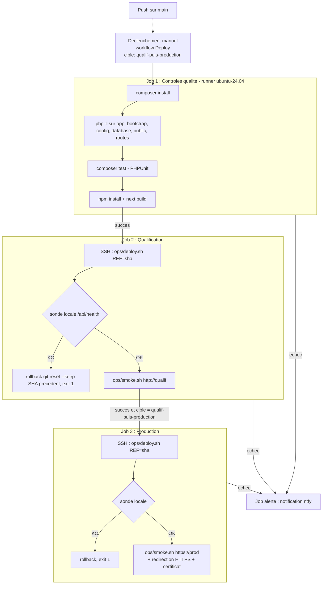

Candidat 06 - LISOWSKI François

# Deploiement automatise

> Competence evaluee : `C31` — Mettre en oeuvre un systeme de deploiement automatise respectant les bonnes pratiques DevOps.

Session du 10 septembre 2026. Fichiers du pipeline en annexe (`livrables/annexes/03/`). Les extraits de journaux proviennent des runs GitHub Actions et des serveurs.

## 1. Strategie de deploiement

### 1.1 Vue d'ensemble

Principe : un meme commit du depot applicatif (branche `main`) est promu vers la qualification, puis vers la production.

Les principes retenus :
- Declenchement explicite (`workflow_dispatch`) : aucune mise en production implicite sur un simple push.
- Une porte qualite bloquante avant tout deploiement : syntaxe PHP, tests automatises, build du microservice.
- Qualification d'abord, production ensuite, et seulement si le deploiement et le smoke test de la qualification ont reussi.
- Mise a jour en place par Git (fast-forward strict sur le SHA teste), sans copie manuelle de fichiers. Chaque serveur lit le depot avec une cle de deploiement en lecture seule.
- Etapes conditionnelles : dependances PHP seulement si `composer.lock` change, migrations seulement si une migration arrive, build Next.js seulement si le microservice change.
- Verification locale (sonde de sante) puis externe (smoke test depuis le runner) ; rollback automatique du code si la verification locale echoue.
- Alerte ntfy si un run echoue.

Environnements concernes : qualification (`eval-dfs-q-tpl-20265-06.it-students.fr`) et production (`eval-dfs-p-tpl-20265-06.it-students.fr`), chacun sur une machine unique.

### 1.2 Diagramme du pipeline



## 2. Outillage retenu

| Outil | Role dans le pipeline | Justification |
| --- | --- | --- |
| GitHub Actions (`.github/workflows/deploy.yml`) | Orchestration : declenchement, enchainement des jobs, secrets, journaux conserves | Le code est deja sur GitHub. Aucun serveur de CI a maintenir, runners ephemeres et journaux historises |
| `shivammathur/setup-php`, `actions/setup-node` | Environnement de controle PHP 8.4 (`mongodb`, `pdo_sqlite`, `intl`, `bcmath`, `zip`) et Node 20 | Reproduit les versions de production pour les controles |
| Composer, PHPUnit (`composer test`) | Dependances et tests automatises Laravel (SQLite en memoire) | Outils natifs du projet, sans dependance a une base externe |
| `next build` | Compilation et verification TypeScript du microservice | Detecte une erreur de build avant qu'elle n'atteigne un serveur |
| SSH (cle ed25519 dediee) | Transport vers les serveurs | Deja ouvert (port 22), chiffre, cle revocable et distincte de celle de l'administrateur |
| `ops/deploy.sh` (bash) | Mise a jour idempotente sur le serveur, avec rollback | Versionne avec le code, utilisable sans GitHub (voie manuelle), sans agent a installer |
| `ops/smoke.sh` (bash + curl + openssl) | Verification post-deploiement vue de l'exterieur | Teste le parcours reel : DNS, TLS, Apache, Laravel, microservice |
| Git + cles de deploiement en lecture seule | Recuperation du code par les serveurs | Un serveur compromis ne peut pas modifier le depot |
| ntfy.sh | Notification d'echec | Meme canal que les alertes de supervision (livrable 04) |

Alternatives ecartees :
- Ansible et Deployer : utiles a plusieurs serveurs, mais surdimensionnes pour deux machines ;
- GitLab CI : depot deja sur GitHub ;
- conteneurs en production : la production est installee en paquets systeme, et la bascule sort du perimetre de l'epreuve. La stack Docker Compose sert d'environnement local.

## 3. Declenchement du deploiement

### 3.1 Mode de declenchement

Manuel et explicite, par `workflow_dispatch`, avec un choix de cible :
- `qualif-puis-production` (defaut) : promotion complete ;
- `qualif` : deploiement de verification sur la qualification seule.

Moyens de lancement :
- interface GitHub : Actions, `Deploy`, `Run workflow` ;
- ligne de commande :

```bash
gh workflow run deploy.yml --repo <depot> --ref main -f target=qualif-puis-production
gh run watch <id>
```

Concurrence : `concurrency: deploy` sans annulation. Deux deploiements ne peuvent pas s'executer en parallele, le second attend.

### 3.2 Reproductibilite

- Le run deploie `github.sha`, le commit exact controle par le job qualite, et non « le dernier commit » au moment ou le serveur tire.
- `git merge --ff-only <sha>` refuse toute divergence : le serveur est exactement au commit teste ou le deploiement echoue.
- Les scripts sont versionnes avec le code. Relancer le workflow sur le meme commit rejoue les memes etapes ; un deploiement sans changement est sans effet sur le code (caches regeneres, rechargement Apache).
- Les versions des outils sont fixees dans le workflow (PHP 8.4, Node 20, `ubuntu-24.04`) et les dependances par les lockfiles (`composer.lock`).
- Voie manuelle identique (pipeline indisponible) : `ssh ubuntu@<hote> "REMOTE=<remote> REF=<sha> bash -s" < ops/deploy.sh`, puis `bash ops/smoke.sh <url>`.

## 4. Controles prealables au deploiement

| Controle | Description | Critere de passage |
| --- | --- | --- |
| Installation des dependances | `composer install --no-interaction --prefer-dist` sur PHP 8.4 avec `ext-mongodb` | code de sortie 0 (lockfile coherent) |
| Syntaxe PHP | `php -l` sur tous les fichiers de `app`, `bootstrap`, `config`, `database`, `public`, `routes` | aucune erreur de syntaxe |
| Tests automatises | `composer test` : sante de l'API, page d'accueil apres seed, API avec token valide, test unitaire | 0 echec et au moins un test execute (le run affiche `Tests: 4 passed (6 assertions)`) |
| Build du microservice | `npm install` puis `next build` (compilation, types) | build termine sans erreur |
| Qualification deployee et verifiee | le job production depend du job qualification (`needs`) | deploiement et smoke test de la qualification au vert |

Preuve que la porte est bloquante (run 1, 10/09 12:05) :
- Le job qualite a echoue : `FAILED Tests\Feature\ExampleTest > the ticket api requires a valid token — Expected response status code [200] but received 401.` (`Tests: 1 failed, 3 passed`).
- Les jobs qualification et production sont restes `skipped`, et l'alerte est partie : `12:05:41 | OpsTrack deploiement | Echec du workflow Deploy #1`.
- Cause : un correctif precedent avait vide le token de demonstration de `.env.example`, alors que le seeder en depend. Corrige par un token dedie aux tests dans `phpunit.xml`, puis run 2 au vert.
- Sans cette porte, la regression aurait ete deployee.

## 5. Mise a jour de la production

Etapes executees par `ops/deploy.sh` sur le serveur, via `ssh ... bash -s` :

1. Memorisation du commit en service (`PREVIOUS`).
2. `git fetch` depuis le depot, avec la cle de deploiement en lecture seule du serveur.
3. `git merge --ff-only <sha>` : mise a jour du code au commit teste.
4. Calcul des fichiers modifies (`git diff --name-only PREVIOUS CURRENT`).
5. Selon les changements :
   - `composer.lock` modifie : `composer install --no-dev --optimize-autoloader --ignore-platform-req=ext-mongodb` ;
   - nouvelle migration : `php artisan migrate --force` ;
   - microservice modifie : `npm install`, `npm run build`, `systemctl restart opstrack-dispatch-dashboard`.
6. En production (`APP_ENV=production`) : `php artisan config:cache`, `route:cache`, `view:cache`.
7. `systemctl reload apache2` : rechargement sans coupure, invalidation d'OPcache.
8. Sonde locale : `GET /api/health` doit renvoyer 200, avec 10 essais espaces de 3 s.
9. Echec d'une etape ou de la sonde : rollback (section 7) et code de sortie 1, donc job en echec.

Duree observee : 12 s en qualification et 14 s en production pour le run 2, sans rebuild du microservice.

## 6. Verification post-deploiement

### 6.1 Smoke tests

`ops/smoke.sh <url>`, execute depuis le runner GitHub, donc depuis Internet :

| Test | Commande ou methode | Resultat attendu |
| --- | --- | --- |
| Sante de l'API | `curl <url>/api/health` | 200 |
| Page d'accueil (Laravel, base, cache) | `curl <url>/` | 200 |
| Protection de l'API | `curl -H 'Accept: application/json' <url>/api/v1/tickets` sans token | 401 |
| Protection du webhook | `curl -X POST <url>/hooks.php` sans authentification | 401 |
| Microservice et chaine inter-services | page `/dispatch-dashboard` contenant une reference `INC-` (Next.js vers API Laravel vers MySQL) | presence de tickets |
| Redirection HTTPS (production) | `curl http://<domaine>/` | 301 |
| Certificat TLS (production) | `openssl s_client` puis `x509 -enddate` | valide encore plus de 7 jours |

Un seul test en echec fait echouer le job, et donc le run (code de sortie 1).

### 6.2 Preuve de deploiement reussi

Run 2, `https://github.com/Grozef/dfs-bloc4-evaluation-app/actions/runs/34464973641` (depot prive), commit `653f131`, conclusion `success` :

```
Controles qualite:          success 10:14:09Z -> 10:15:22Z
Deploiement qualification:  success 10:15:26Z -> 10:15:38Z
Deploiement production:     success 10:15:41Z -> 10:15:55Z
Alerte en cas d'echec:      skipped

Controles qualite | Tests |   Tests:    4 passed (6 assertions)
Controles qualite | Build du microservice |  ✓ Compiled successfully in 4.0s
Deploiement qualification | Deploiement | Deploiement c1a16ad -> 653f131 (2 fichier(s))
Deploiement qualification | Deploiement | Deploiement reussi : 653f131
Deploiement qualification | Smoke test | OK    GET /api/health (200)
Deploiement qualification | Smoke test | OK    GET / (200)
Deploiement qualification | Smoke test | OK    API sans token (401)
Deploiement qualification | Smoke test | OK    hooks.php sans authentification (401)
Deploiement qualification | Smoke test | OK    supervision affiche des tickets (oui)
Deploiement production | Deploiement | Deploiement c1a16ad -> 653f131 (2 fichier(s))
Deploiement production | Deploiement | Deploiement reussi : 653f131
Deploiement production | Smoke test | OK    GET /api/health (200)
Deploiement production | Smoke test | OK    GET / (200)
Deploiement production | Smoke test | OK    API sans token (401)
Deploiement production | Smoke test | OK    hooks.php sans authentification (401)
Deploiement production | Smoke test | OK    supervision affiche des tickets (oui)
Deploiement production | Smoke test | OK    HTTP redirige vers HTTPS (301)
Deploiement production | Smoke test | OK    certificat valide plus de 7 jours (oui)
```

Controles cote serveurs apres le run :
- `git log --oneline -1` renvoie `653f131 Give the test suite its own API token` en production comme en qualification ;
- `auth.log` en production : `Accepted publickey for ubuntu from 52.159.247.161 ... ED25519`, a 12:15:45. C'est la connexion du runner GitHub avec la cle dediee du pipeline, et non la cle de l'administrateur.

Run 3, `https://github.com/Grozef/dfs-bloc4-evaluation-app/actions/runs/34470558831`, commit `80410fb` (montee de Next.js en 15.5.25 pour corriger des failles critiques), conclusion `success`. Ce run exerce le chemin conditionnel « microservice modifie » : `npm install`, `next build` et redemarrage du service sur chaque serveur.

```
Controles qualite:          success 11:18:05Z -> 11:19:12Z   (Tests: 4 passed ; ▲ Next.js 15.5.25, Compiled successfully)
Deploiement qualification:  success 11:19:15Z -> 11:20:14Z
Deploiement production:     success 11:20:18Z -> 11:21:35Z
Deploiement production | Deploiement | Deploiement 653f131 -> 80410fb (1 fichier(s))
Deploiement production | Deploiement |    ▲ Next.js 15.5.25
Deploiement production | Deploiement |  ✓ Compiled successfully in 11.2s
Deploiement production | Deploiement | Deploiement reussi : 80410fb
Deploiement production | Smoke test | OK    ... (7 tests OK, dont redirection HTTPS et certificat)
```

Apres le run, sur les deux serveurs : HEAD `80410fb`, `node_modules/next/package.json` en 15.5.25, supervision affichant `INC-240301 INC-240302`.

Effet de bord a surveiller : le rebuild fait passer le disque de production a 86 %, au-dessus du seuil de la sonde `disk`. Il a ete ramene a 82 % en purgeant le cache npm, et une purge de `~/.npm/_cacache` en fin de `deploy.sh` est a ajouter.

## 7. Conduite a tenir en cas d'echec

Comportement automatique :

| Echec | Effet |
| --- | --- |
| Controles qualite | aucun serveur touche. Les jobs suivants passent `skipped`, alerte ntfy |
| Deploiement ou sonde locale en qualification | rollback du code sur la qualification, production non touchee, alerte |
| Smoke test externe en qualification | production non touchee, alerte. La qualification reste sur le nouveau commit pour le diagnostic |
| Deploiement ou sonde locale en production | rollback automatique vers le commit precedent, alerte |
| Smoke test externe en production | alerte. Rollback manuel apres diagnostic (voir ci-dessous) |

Rollback automatique de `ops/deploy.sh` :
- `git reset --keep <commit precedent>` ;
- regeneration des caches ;
- rebuild et redemarrage du microservice si besoin ;
- rechargement d'Apache ;
- nouvelle sonde, puis sortie en erreur.

Limite connue : les migrations deja executees ne sont pas annulees automatiquement (risque de perte de donnees). Toute migration destructive doit etre precedee d'une sauvegarde (`sudo systemctl start opstrack-backup.service`).

Test du rollback, realise le 10/09 sur la qualification avec une URL de sonde volontairement fausse :

```
12:21:30  ssh ... "REMOTE=fork REF=653f131 SMOKE_URL=http://127.0.0.1:9 bash -s" < ops/deploy.sh
Deploiement 9a962ec -> 653f131 (1 fichier(s))
ECHEC du deploiement de 653f131 : rollback vers 9a962ec
Rollback effectue (9a962ec) mais le smoke test echoue toujours   (normal : l'URL de sonde restait fausse)
code de sortie : 1
HEAD apres rollback : 9a962ec ; /api/health : 200
12:22:34  redeploiement normal
Deploiement 9a962ec -> 653f131 (1 fichier(s))
Deploiement reussi : 653f131
OK    GET /api/health (200) ... OK    supervision affiche des tickets (oui)
```

Procedure humaine :
1. Lire le job en echec : `gh run view <id> --log-failed`.
2. Sur le serveur : `journalctl -t opstrack-healthcheck -n 20`, `tail storage/logs/laravel.log`, `tail /var/log/apache2/opstrack_error.log`, `journalctl -u opstrack-dispatch-dashboard -n 50`.
3. Revenir a la derniere version saine si le service est degrade : `git reset --keep <sha sain>`, puis relancer `ops/deploy.sh` avec `REF=<sha sain>` et verifier par `ops/smoke.sh`.
4. Restaurer les donnees si une migration les a alterees : `ops/restore.sh` (livrable 04).
5. Corriger dans le code, pousser, relancer le workflow. Ne jamais modifier le code directement sur le serveur : le prochain `merge --ff-only` echouerait.

## 8. Scripts et fichiers de configuration

| Fichier | Role |
| --- | --- |
| `.github/workflows/deploy.yml` | Definition du pipeline : declencheur, jobs qualite, qualification, production et alerte, concurrence |
| `ops/deploy.sh` | Mise a jour d'un serveur au commit demande, etapes conditionnelles, sonde locale, rollback |
| `ops/smoke.sh` | Smoke tests externes (HTTP, API, webhook, microservice, HTTPS, certificat) |
| Secret `DEPLOY_SSH_KEY` | Cle privee ed25519 du pipeline. Sa cle publique est dans `~ubuntu/.ssh/authorized_keys` des deux serveurs |
| Secret `KNOWN_HOSTS` | Cles d'hote SSH des serveurs, lues sur les serveurs eux-memes : pas de `StrictHostKeyChecking=no` |
| Secret `NTFY_TOPIC` | Topic d'alerte |
| Variables `QUALIF_HOST`, `PROD_HOST` | Noms DNS cibles, hors du code du workflow |
| Cles de deploiement GitHub `qualif-06`, `prod-06` | Lecture seule du depot par chaque serveur |
| `phpunit.xml` | Environnement des tests (SQLite en memoire, token dedie) |

Limites et ameliorations :
- Environnement protege avec approbation manuelle avant la production : non disponible sur un depot prive gratuit, remplace ici par le choix explicite de la cible au declenchement.
- La cle du pipeline ouvre un shell `ubuntu` avec `sudo` : a restreindre a un utilisateur de deploiement dedie.
- Tests a etoffer (webhook, droits des tokens, cache), pour que la porte qualite protege les correctifs de l'epreuve.
