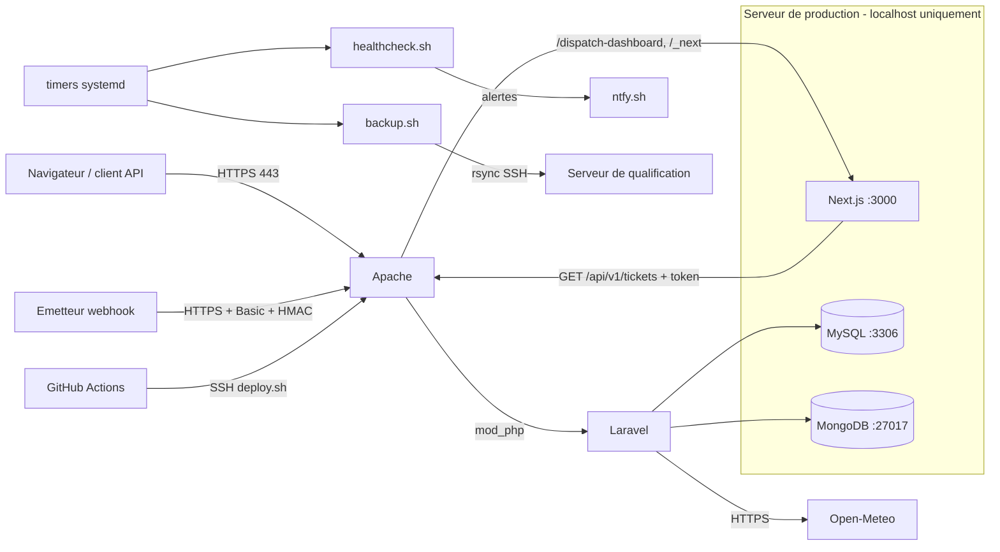

Candidat 06 - LISOWSKI François

# Base de connaissances — Note de passation

Ce document est destine a un pair charge de reprendre la maintenance de l'application. Il doit permettre de comprendre le fonctionnement, les points d'attention et les procedures essentielles sans zone d'ombre majeure.

Etat au 10/09/2026. Documents associes :
- `documentation_api.md` (API et webhook) ;
- `CHANGELOG.md` et `SECURITY.md` ;
- `documentation_technique/` (reference des classes, generee depuis le code) ;
- livrables 02 (exploitation), 03 (deploiement) et 04 (supervision).

## 1. Presentation de l'application

OpsTrack Field Service gere des interventions de maintenance sur des sites clients.

Utilisateurs :
- superviseurs, qui ouvrent et suivent les tickets ;
- techniciens, qui interviennent sur site ;
- systemes tiers, via l'API et le webhook.

Fonctionnalites :
- tableau de bord web avec indicateurs (tickets ouverts, critiques, crees du jour, techniciens) et derniers tickets ;
- API REST `/api/v1` : tickets (liste filtree, detail, creation, mise a jour), techniciens, meteo du site ;
- webhook `hooks.php` : un prestataire externe pousse l'avancement d'une intervention ;
- microservice `dispatch-dashboard` : tableau de bord dedie aux superviseurs ;
- journal technique des evenements metier dans MongoDB ;
- enrichissement meteo par l'API publique Open-Meteo.

## 2. Architecture technique

### 2.1 Composants principaux

| Composant | Technologie | Role |
| --- | --- | --- |
| Application coeur | Laravel 12.54 / PHP 8.4, sous Apache 2.4 (mod_php) | tableau de bord web `/`, API REST, webhook |
| Base relationnelle | MySQL 8.0 (base `opstrack`) | users, customers, sites, tickets, interventions, api_tokens, cache, sessions, jobs |
| Base NoSQL | MongoDB 8.0 (base `opstrack_logs`, collection `event_logs`) | journal des evenements metier |
| Cache | Redis 7 (installe) | non utilise en l'etat : `CACHE_STORE=database`, `SESSION_DRIVER=database` |
| Microservice | Next.js 15.5 / Node.js, service systemd `opstrack-dispatch-dashboard` sur `127.0.0.1:3000` | tableau de bord superviseurs, lit `GET /api/v1/tickets` avec un token |
| API externe | Open-Meteo | meteo courante par site |
| TLS | Let's Encrypt / Certbot | certificat de production |
| Exploitation | scripts `ops/`, timers systemd, GitHub Actions | deploiement, sondes, sauvegardes, durcissement |

### 2.2 Schema d'architecture



Flux :
- `hooks.php` est a la racine de `public/`, hors routeur Laravel. Il initialise le noyau puis appelle `WebhookController`.
- Les requetes du microservice Next.js repassent par Apache sur `127.0.0.1` (`LARAVEL_API_BASE_URL=http://127.0.0.1/api/v1`).

## 3. Points d'attention connus

Code :
- Cache des indicateurs : cle `dashboard.kpis` (30 min), invalidee par les evenements `saved` et `deleted` du modele `Ticket`. Une modification faite en SQL direct ne l'invalide pas : lancer `php artisan cache:forget dashboard.kpis`.
- Journal MongoDB : le modele `App\Models\Mongo\EventLog` declare `$collection = 'app_events'`, mais `laravel-mongodb` 5.x utilise `$table`. Les documents sont donc dans `event_logs`. Une panne MongoDB ne bloque pas l'application : avertissement `MongoDB logging unavailable.` dans `laravel.log`.
- Webhook :
  - format de signature : HMAC-SHA256 hexadecimal du corps brut, en-tete `X-OpsTrack-Signature` ;
  - identifiants ou secret vides : tout est refuse ;
  - la deduplication repose sur `external_event_id` (absent, pas de deduplication).
- Migrations : `interventions` depend de `tickets`. Toute nouvelle migration a cle etrangere doit avoir un horodatage STRICTEMENT posterieur a sa table cible : a horodatage egal, l'ordre est alphabetique (erreur MySQL 1824).
- Seeder : cree 3 utilisateurs de demonstration (mot de passe de demonstration) et le token du microservice a partir de `OPSTRACK_API_TOKEN`. Ne jamais lancer `migrate:fresh --seed` en production avec des donnees reelles.
- Tests : `composer test` utilise SQLite en memoire et un token dedie (`phpunit.xml`). La suite est courte (5 tests) : elle ne couvre ni le webhook ni les droits des tokens.

Dependances et versions :
- `ext-mongodb` 2.1.4 sur les serveurs, alors que le lockfile exige ^2.2 : `composer install ... --ignore-platform-req=ext-mongodb`. Fonctionne, mais a regulariser.
- Node.js 18 en production (hors support), 20 en qualification et en CI.
- Microservice en `next` 15.5.25 depuis le 10/09 : avis critiques de la 15.3.1 corriges (`SECURITY.md`, faille 10). Residuel sans critique : `postcss` et `sharp`, a traiter au passage a Next 16. Controler `npm audit --omit=dev` a chaque mise a jour du microservice. Chaque rebuild sur le serveur fait monter le disque (86 % observes) : purger `~/.npm/_cacache` apres le deploiement.

Microservice et configuration :
- Microservice : token dans `microservices/dispatch-dashboard/.env.local`. Il doit correspondre a un token actif avec le droit `tickets:read`. Apres modification : `sudo systemctl restart opstrack-dispatch-dashboard`.
- Configuration mise en cache en production (`config:cache`) : toute modification de `.env` exige `php artisan config:cache`, sinon elle est ignoree.

Systeme :
- Ubuntu 24.04 : sshd journalise sous `ssh.service`. La jail fail2ban versionnee en tient compte : ne pas la remplacer par le filtre par defaut.
- Machine unique en production, disque de 6,8 Go (82 % apres nettoyage) : surveiller la sonde `disk`, surtout apres un build Next.js.

Qualification :
- Configuration d'origine conservee, car ce sont les acces fournis pour l'evaluation (debug actif, phpMyAdmin public, compte `root` par defaut).
- A durcir des qu'elle redevient un environnement de travail normal.

## 4. Procedures operationnelles

### 4.1 Deploiement

Voie normale, pipeline GitHub Actions `Deploy` (`.github/workflows/deploy.yml`) :
1. pousser le code sur `main` du depot applicatif ;
2. GitHub, onglet Actions, `Deploy`, `Run workflow`, cible `qualif-puis-production` (ou `qualif` seule). En ligne de commande : `gh workflow run deploy.yml -f target=qualif-puis-production` ;
3. le pipeline enchaine :
   - controles qualite : dependances, `php -l`, `composer test`, build Next ;
   - deploiement et smoke test de la qualification ;
   - deploiement et smoke test de la production ;
   - alerte ntfy en cas d'echec ;
4. suivre : `gh run watch`. Verifier en production : `git -C /var/www/opstrack log --oneline -1` doit donner le SHA du run.

`ops/deploy.sh`, sur le serveur :
- enregistre le SHA courant, puis fait `git fetch` et `merge --ff-only` du SHA demande ;
- relance `composer install` si le lockfile a change, `migrate` si une migration est arrivee, et les caches Laravel en production ;
- rebuild et redemarre Next.js si le microservice a change, puis recharge Apache ;
- lance le smoke test local. En cas d'echec : `git reset --keep` sur le SHA precedent, caches reconstruits, exit 1.

Voie manuelle (pipeline indisponible) : meme script depuis un poste disposant d'un acces SSH :

```bash
ssh ubuntu@<hote> "REMOTE=<origin en prod | fork en qualif> REF=<sha> bash -s" < ops/deploy.sh
bash ops/smoke.sh https://<domaine>
```

Rollback manuel :
- relancer le deploiement avec `REF=<sha precedent>`, apres `git reset --keep <sha>` sur le serveur ;
- les migrations deja appliquees ne sont pas annulees : ecrire une migration corrective ;
- changement de configuration serveur (vhost, jail, timers) : `sudo bash ops/provision.sh [--with-backup]`, idempotent.

### 4.2 Sauvegarde et restauration

Principe :
- Sauvegarde automatique (production) : `opstrack-backup.timer`, tous les jours a 02:30.
- Contenu : dump MySQL, archive MongoDB, archive de configuration (`.env`, vhosts, unite Next, Let's Encrypt, `/etc/opstrack`) et `SHA256SUMS`.
- Emplacement : `/var/backups/opstrack/<AAAAMMJJ-HHMMSS>/` (7 jours). Copie sur la qualification dans `/var/backups/opstrack-prod/`.
- Sauvegarde immediate : `sudo systemctl start opstrack-backup.service`, puis `journalctl -u opstrack-backup -n 5`.

Restauration :

```bash
# 1. choisir le dossier (local, ou recuperer la copie depuis la qualification)
sudo ls /var/backups/opstrack/
# 2. restaurer (verifie les empreintes, cree la base si besoin, remplace les collections MongoDB)
sudo bash /var/www/opstrack/ops/restore.sh /var/backups/opstrack/<dossier> opstrack opstrack_logs
# 3. si le serveur est reconstruit : extraire la configuration
sudo tar -xzf /var/backups/opstrack/<dossier>/config.tar.gz -C /
# 4. recharger
cd /var/www/opstrack && php artisan config:cache && php artisan cache:forget dashboard.kpis
sudo systemctl restart opstrack-dispatch-dashboard && sudo systemctl reload apache2
bash ops/smoke.sh https://<domaine>
```

Procedure validee le 10/09 sur la qualification, dans des bases de test : comptes identiques a la production (livrable 04, section 4.2).

### 4.3 Supervision et alertes

- Sondes : `opstrack-healthcheck.timer`, toutes les 5 min. Resultats : `journalctl -t opstrack-healthcheck --since -1h`.
- Alertes : notifications ntfy « ALERTE <sonde> » et « RETABLI <sonde> ». Le topic est dans `/etc/opstrack/healthcheck.env` : s'y abonner dans l'application ntfy.
- Echec du pipeline : notification « OpsTrack deploiement ».

| Alerte | Premiers gestes |
| --- | --- |
| `http_health` | `systemctl status apache2 mysql`, `tail /var/log/apache2/opstrack_error.log`, `grep ERROR storage/logs/laravel.log` |
| `dashboard` | `systemctl status opstrack-dispatch-dashboard`, `journalctl -u opstrack-dispatch-dashboard -n 50`. Verifier que le token de `.env.local` est actif (`select name,is_active,abilities from api_tokens`) |
| `services` | `systemctl status <service>`, `journalctl -u <service> -n 50`, puis `systemctl restart <service>` |
| `disk` | `du -xh / --max-depth=2 \| sort -h \| tail`, `sudo apt-get clean`, `sudo journalctl --vacuum-size=100M`, purge des caches npm ou composer |
| `certificate` | `sudo certbot renew`, `systemctl status certbot.timer`, verifier le DNS et le port 80 |
| `laravel_errors` | lire les dernieres lignes `ERROR` de `laravel.log`, reproduire, corriger |
| `ssh_bans` | `sudo fail2ban-client status sshd`, `zcat -f /var/log/auth.log* \| grep <ip>`. Bannissement durable si recidive : `sudo ufw deny from <ip>` |
| `backup_age` | `journalctl -u opstrack-backup -n 20`, relancer la sauvegarde, verifier l'espace disque et l'acces SSH vers la qualification |

Audit :
- `sudo ausearch -k opstrack-secrets -i` : modifications de `.env` et des secrets ;
- `-k opstrack-ssh` : cles et configuration SSH ;
- `-k opstrack-web` : vhosts.

### 4.4 Acces et secrets

| Acces | Moyen | Ou trouver le secret |
| --- | --- | --- |
| SSH qualification et production | utilisateur `ubuntu`, cle privee remise par le centre | fiche confidentielle du centre (hors depot) |
| Depot applicatif | GitHub, depot prive du mainteneur | acces GitHub du mainteneur |
| Serveurs vers GitHub | cle de deploiement en lecture seule, par serveur | `~ubuntu/.ssh/opstrack_deploy` sur chaque serveur |
| Pipeline vers serveurs | cle ed25519 dediee `opstrack-ci-deploy` | secret GitHub `DEPLOY_SSH_KEY` (+ `KNOWN_HOSTS`, `NTFY_TOPIC`, variables `QUALIF_HOST` et `PROD_HOST`) |
| Application (`APP_KEY`, base, token API, webhook) | fichier `.env` | `/var/www/opstrack/.env` (640) sur chaque serveur |
| Token du microservice | fichier `.env.local` | `/var/www/opstrack/microservices/dispatch-dashboard/.env.local` (600) |
| MySQL administrateur (production) | `sudo mysql` | `/root/.my.cnf` (600) |
| Alertes et destination de sauvegarde | fichiers d'environnement systemd | `/etc/opstrack/healthcheck.env`, `/etc/opstrack/backup.env` (600) |
| Copie des sauvegardes (production vers qualification) | cle `root` restreinte `rrsync -wo` | `/root/.ssh/opstrack_backup` en production |

Rotation d'un secret :
1. generer (`openssl rand -hex 32`) ;
2. mettre a jour le fichier ;
3. `php artisan config:cache` ;
4. redemarrer le service concerne ;
5. prevenir les consommateurs (emetteur du webhook, microservice, secrets GitHub).

## 5. Bugs et failles corriges pendant l'epreuve

| Correction | Pourquoi |
| --- | --- |
| Recherche + priorite regroupees, requete parametree | le filtre de priorite etait ignore, et l'entree utilisateur injectee en SQL |
| Invalidation du cache des indicateurs | le tableau de bord affichait des compteurs vieux de 30 minutes |
| `hooks.php` initialise Laravel | le webhook repondait 500 a chaque appel |
| Webhook : statut applique et deduplication | les mises a jour externes etaient ignorees (ticket force a `scheduled`) et les interventions dupliquees |
| Microservice : `payload.data` | le tableau de bord de supervision etait vide |
| Droits des tokens par route | tout token pouvait tout faire |
| Signature HMAC du webhook, identifiants de demonstration retires | le webhook n'etait protege que par des identifiants de demonstration |
| Ordre des migrations | installation impossible sur base vide |
| Mise en production securisee | HTTPS, pare-feu, services en local, secrets, SSH, fail2ban, audit, sondes, sauvegardes |

Detail : `CHANGELOG.md`, `SECURITY.md`, livrable 04 (section 7.2).

## 6. Ameliorations recommandees

1. Ajouter des tests automatises sur le webhook (signature, deduplication), les droits des tokens et l'invalidation du cache : la suite actuelle ne protege pas ces correctifs.
2. Aligner `EventLog` (`$table = 'event_logs'`) et documenter le schema du journal.
3. Regulariser `ext-mongodb` (2.2 via PECL) et passer la production en Node.js 20 LTS.
4. Renseigner `WEBHOOK_ALLOWED_IPS` des que l'emetteur reel du webhook est identifie. Prevoir un horodatage dans la signature (anti-rejeu hors deduplication).
5. Durcir la qualification quand elle n'est plus un environnement d'evaluation : phpMyAdmin restreint ou retire, `APP_DEBUG=false`, compte `root`, `Options -Indexes`, ufw.
6. Utilisateur de deploiement dedie, avec `sudo` limite aux commandes de `ops/deploy.sh`, a la place de `ubuntu`.
7. Sauvegardes vers un stockage objet externe chiffre et versionne, avec purge automatique des copies sur la qualification.
8. Un token API par consommateur (microservice, partenaires), avec droits minimaux et rotation.
9. Supervision externe (sonde HTTP depuis l'exterieur) en complement des sondes locales.
10. Enregistrement DNS CAA et, a terme, architecture cible du livrable 01 (redondance, services manages).

## 7. Contacts et ressources

| Ressource | Emplacement |
| --- | --- |
| Depot de l'application (code, `ops/`, pipeline) | GitHub, depot prive du mainteneur (branche `main`). Depot d'origine : `github.com/itakademy/dfs-bloc4-evaluation-app` |
| Livrables et annexes | depot `dfs-bloc4-evaluation-sujet`, dossier `livrables/` |
| Production | `https://eval-dfs-p-tpl-20265-06.it-students.fr`, supervision : `/dispatch-dashboard` |
| Qualification | `http://eval-dfs-q-tpl-20265-06.it-students.fr` |
| Environnement local | `docker compose up -d --build` (README du depot) : Laravel sur `localhost:8000`, Next.js sur `localhost:3000` |
| Documentation technique generee | `documentation_technique/index.html` |
| Documentation externe | Laravel 12 (laravel.com/docs), laravel-mongodb (mongodb.com/docs/drivers/php/laravel-mongodb), Next.js 15, Certbot, fail2ban |
| Contact technique | equipe de maintenance OpsTrack, via le suivi d'incidents du depot |
